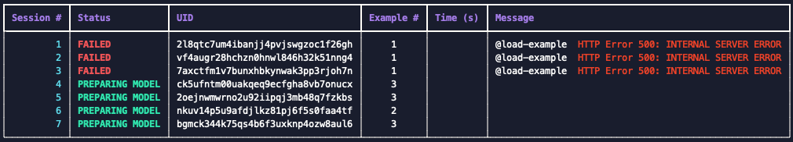

# MusicBox Load Tester


This repo contains musicbox-destroyer.py, a script to be used to load test [Music Box Interactive](https://musicbox.acom.ucar.edu/) and run an excessive amount of simulations at once as well as simulate a DDOS or targeted attack.

## Required Packages

- requests

```bash
pip3 install requests
```

## Usage

```bash
Usage: python musicbox-destroyer.py <number of sessions> [--wait] [--fixed-example] [--run-asynchronously] [--ddos-mode]

Example: python musicbox-destroyer.py 20 --wait

        --wait: wait for each session to finish before exiting. Default is to exit as soon as all sessions are created but not necessarily finished.
        --fixed-example: use the same example for each session (default is to use a random example)
        --run-asynchronously: run each session in a separate thread (default is to run each session sequentially). This is useful for testing the server's ability to handle multiple sessions at once (load testing), but it will not give you an accurate idea of how long it takes to run a single session.
        --ddos-mode: can be run in asynchronous or synchronous mode. Once sessions are done running in this mode they'll be restarted from the beginning. This is useful for testing the server's ability to handle a large number of sessions at once (DDoS testing). To stop the script, press CTRL+C, otherwise it'll run forever. For this mode the <number of sessions> will indicate how many should run at a time, however, the script will keep creating new sessions until you stop it.
       
```

Status Definitions:
- "Creating...": currently fetching remote UID and creating session
- "PREPARING EXAMPLE": Setting example for current session
- "FAILED": Generally returned when there is a server-side or request error. Check the "Message" column for exact error info while running.
- "RUNNING MODEL": Submitting request to server to start running the simulation
- "WAITING": Simulation has started, waiting for message from server that it is done.
- "DONE!!": Simulation has completely finished, once all sessions have finished then the script will exit.


## Example output


Above is an example of how errors are presented in real time while running. The format for how errors are presented is: @{API ENDPOINT} {ERROR}

## License

[MIT](https://choosealicense.com/licenses/mit/)
